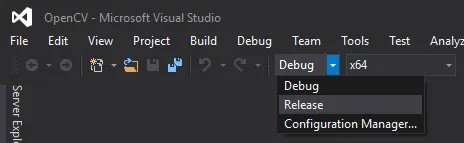
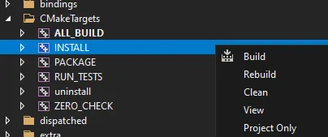
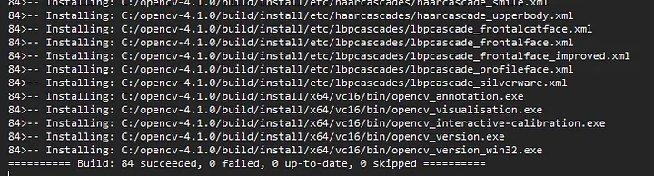

# **How to Build OpenCV 4.12.0 on Window10/11 (Maybe the same)**

## **Download and Installation**

### 1. **Requirement:**

- **Cmake (Latest version)**
- **Python 3.9+ (for me, it is Python 3.12.0 and 3.13.5)**
- **Visual Studio 2022 Community Edition / Visual Studio Build Tool 2022**
- **Git for Windows** (Check “Add CMake to system PATH” during installation.)
  
### 2. **Downlaod Gstreamer**

Install both gstreamer-runtime and gstreamer-development package in the same location (MinGW 64-bit) >> <https://gstreamer.freedesktop.org/download/>

- gstreamer-1.0-mingw-x86_64-1.24.8.msi (Runtime)
- gstreamer-1.0-mingw-msvc-x86_64-1.24.8.msi (Development)

After installation, combined two file together and the Gstreamer path would be like /path-to-gstreamer-installed/1.0/mingw_x86_64/..

**Then, set the enviormental Variables !!!**

```text
# Add to PATH (refer to your path):
F:\software\GStreamer\1.0\mingw_x86_64\bin
F:\software\GStreamer\1.0\mingw_x86_64\lib
```

```bat
# Add to System Variables:
GSTREAMER_1_0_ROOT_MSVC_X86_64 = F:\software\GStreamer\1.0\mingw_x86_64
GSTREAMER_ROOT_X86_64 = F:\software\GStreamer\1.0\mingw_x86_64
GSTREAMER_DIR = F:\software\GStreamer\1.0\mingw_x86_64
```

**Test GStreamer**

```bat
gst-inspect-1.0 --version
gst-launch-1.0 videotestsrc ! autovideosink
```

### 3. **Downlaod OpenCV**

**Prepare Workspace**

```bat
mkdir C:\opencv_build
cd C:\opencv_build
```

**Download OpenCV and Contrib**

```sh
# OpenCV main code
git clone https://github.com/opencv/opencv.git
cd opencv
git checkout 4.12.0 #up to 2025.11.17, it is the latest release.
```

```sh
# OpenCV Contrib
git clone https://github.com/opencv/opencv_contrib.git
cd opencv_contrib
git checkout 4.12.0 #up to 2025.11.17, it is the latest release.
```

### 4. **CMake Configuration**

First if you only to install on your based enviorment, and you set your python right, you can use cmake-gui or command according to your preference.

**Bur if you need you configure for other version of python which is not the same as your base enviorment, especialy in the venv. I recommend using the command line so that you can activate your venv**

#### **cmake-gui**

- Select opencv source and build folder.
- Click “Configure” the new window will show up then select your Visual Studio version then click Finish.

Set the cmake configuration as following:

```text
WITH_GSTREAMER=ON
CMAKE_BUILD_TYPE=Release
BUILD_opencv_python3=ON
BUILD_SHARED_LIBS=ON
BUILD_opencv_world=ON
BUILD_opencv_gapi=ON
BUILD_TESTS=OFF
BUILD_PERF_TESTS=OFF
BUILD_EXAMPLES=OFF
OPENCV_EXTRA_MODULES_PATH=F:/Documents/A-SoRAtO/graduated/Project/Tool/opencv-gstream/opencv_contrib/modules
```

If you meet the folloing situation, you need to manually add the Gstreamer Path.

```bat
Video I/O:
    GStreamer: NO 
```

```text
GSTREAMER_INCLUDE_DIR=F:/software/GStreamerMSVC/develop/1.0/msvc_x86_64/include/gstreamer-1.0
GSTREAMER_LIBRARY_DIR=F:/software/GStreamerMSVC/develop/1.0/msvc_x86_64/lib
GSTREAMER_DIR=F:/software/GStreamerMSVC/develop/1.0/msvc_x86_64
GSTREAMER_INCLUDE_DIR=F:/software/GStreamerMSVC/develop/1.0/msvc_x86_64/include/gstreamer-1.0
GSTREAMER_LIBRARY=F:/software/GStreamerMSVC/develop/1.0/msvc_x86_64/lib/gstreamer-1.0.lib
GSTREAMER_APP_LIBRARY=F:/software/GStreamerMSVC/develop/1.0/msvc_x86_64/lib/gstapp-1.0.lib
GSTREAMER_BASE_LIBRARY=F:/software/GStreamerMSVC/develop/1.0/msvc_x86_64/lib/gstbase-1.0.lib
GSTREAMER_VIDEO_LIBRARY=F:/software/GStreamerMSVC/develop/1.0/msvc_x86_64/lib/gstvideo-1.0.lib
GLIB2_LIBRARY=F:/software/GStreamerMSVC/develop/1.0/msvc_x86_64/lib/glib-2.0.lib
GOBJECT2_LIBRARY=F:/software/GStreamerMSVC/develop/1.0/msvc_x86_64/lib/gobject-2.0.lib
```

Then configure again.
After the second configure, you should see:

```bat
  Video I/O:
    FFMPEG:                      YES (prebuilt binaries)
      avcodec:                   YES (58.134.100)
      avformat:                  YES (58.76.100)
      avutil:                    YES (56.70.100)
      swscale:                   YES (5.9.100)
      avdevice:                  NO
    GStreamer:                   YES (1.26.7) ← SUCCESS!
    DirectShow:                  YES
    Media Foundation:            YES
      DXVA:                      YES
```


#### Command line in Visual Studiao Build Tool 2022

Open the Visual Studiao Build Tool 2022, activate the venv needed, and go to your build workspace.

```bash
conda activate venv
cd /path/to/your/workspace/
```

run the cmake configure command (if your set the gstreamer right, or you need to set the gstreamer path as the step in cmake-gui)

```bat
cmake ^
-S F:/Documents/A-SoRAtO/graduated/Project/Tool/opencv-gstream/opencv ^
-B F:/Documents/A-SoRAtO/graduated/Project/Tool/opencv-gstream/opencvBuild_3.12.0 ^
-D BUILD_opencv_python3=ON ^
-D CMAKE_BUILD_TYPE=Release ^
-D OPENCV_EXTRA_MODULES_PATH=F:/Documents/A-SoRAtO/graduated/Project/Tool/opencv-gstream/opencv_contrib/modules ^
-D BUILD_SHARED_LIBS=ON ^
-D BUILD_opencv_world=ON ^
-D WITH_GSTREAMER=ON ^
-D BUILD_opencv_gapi=ON ^
-D BUILD_TESTS=OFF ^
-D BUILD_PERF_TESTS=OFF ^
-D BUILD_EXAMPLES=OFF ^
```

After configuration, the result would include the same as cmake-gui:

```bat
  Video I/O:
    FFMPEG:                      YES (prebuilt binaries)
      avcodec:                   YES (58.134.100)
      avformat:                  YES (58.76.100)
      avutil:                    YES (56.70.100)
      swscale:                   YES (5.9.100)
      avdevice:                  NO
    GStreamer:                   YES (1.26.7) ← SUCCESS!
    DirectShow:                  YES
    Media Foundation:            YES
      DXVA:                      YES
```

### 5. **Build**

In cmake-gui, Click "Generate" and Click "Open Project".



In Visual Studio, switch from DEBUG to RELEASE and x64.



Then right click on INSTALL and select Build.



In command line, run 

```sh
cmake --build . --config Release --target install
```

Finally, add bin & lib folder to your env PATH.

```bat
F:\Documents\A-SoRAtO\graduated\Project\Tool\opencv-gstream\opencvBuild_3.12.0\install\x64\vc17\bin
F:\Documents\A-SoRAtO\graduated\Project\Tool\opencv-gstream\opencvBuild_3.12.0\install\x64\vc17\lib
```

For the Python >= 3.8, this versions of python don’t load .dll from PATH due to new policy.

you need to add gstreamer DLL dir to config.py.

```python
import os

BINARIES_PATHS = [
    os.path.join('F:/Documents/A-SoRAtO/graduated/Project/Tool/opencv-gstream/opencvBuild8/install', 'x64/vc17/bin')
    ,'F:/software/GStreamer/1.0/mingw_x86_64/bin' # Add this path where you install the Gstreamer.
] + BINARIES_PATHS

```

### 5. **Validation**

```python
# Identify the location of a cv2 module
import cv2
print(cv2.__file__)"

# Check build information
print(cv2.getBuildInformation())
```

```python
  Video I/O:
    FFMPEG:                      YES (prebuilt binaries)
      avcodec:                   YES (58.134.100)
      avformat:                  YES (58.76.100)
      avutil:                    YES (56.70.100)
      swscale:                   YES (5.9.100)
      avdevice:                  NO
    GStreamer:                   YES (1.26.7) ← SUCCESS!
    DirectShow:                  YES
    Media Foundation:            YES
      DXVA:                      YES
```

```python
import cv2

pipeline = 'autovideosrc ! videoconvert ! appsink'

# Explicitly tell OpenCV to use GStreamer backend
cap = cv2.VideoCapture('videotestsrc ! videoconvert ! appsink', cv2.CAP_GSTREAMER)

if not cap.isOpened():
    print("Error: Could not open GStreamer pipeline.")
    exit()

while True:
    ret, frame = cap.read()

    if not ret or frame is None:
        print("Error: Failed to read frame from pipeline.")
        break

    cv2.imshow('GStreamer Camera', frame)

    if cv2.waitKey(1) & 0xFF == ord('q'):
        break

cap.release()
cv2.destroyAllWindows()
```


## REFERENCE

- **<https://galaktyk.medium.com/how-to-build-opencv-with-gstreamer-b11668fa09c>**

- **<https://medium.com/@kenancan.dev/building-opencv-gstreamer-on-windows-a-8-hour-battle-bdb3211aa834>**

- **<https://stackoverflow.com/questions/78584323/building-opencv-with-gstreamer-on-windows-copy-to-other-computer-without-instal>**